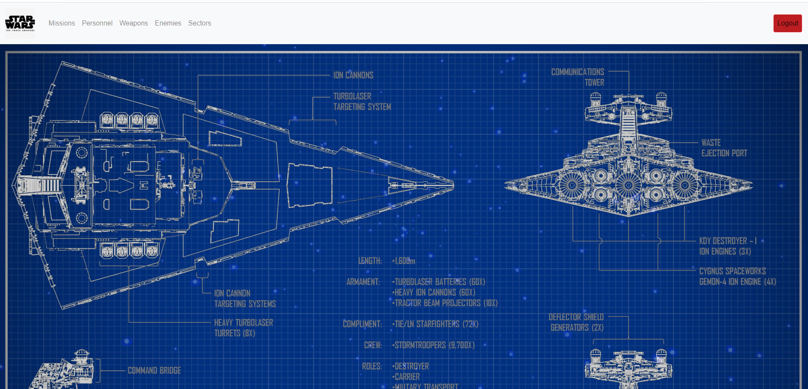
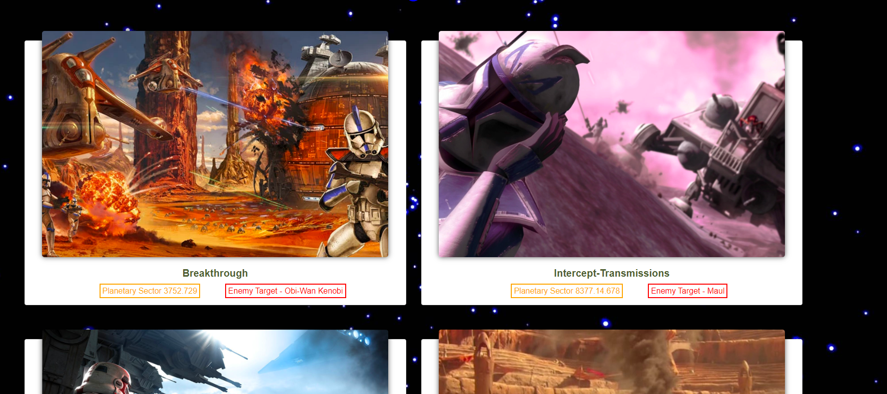
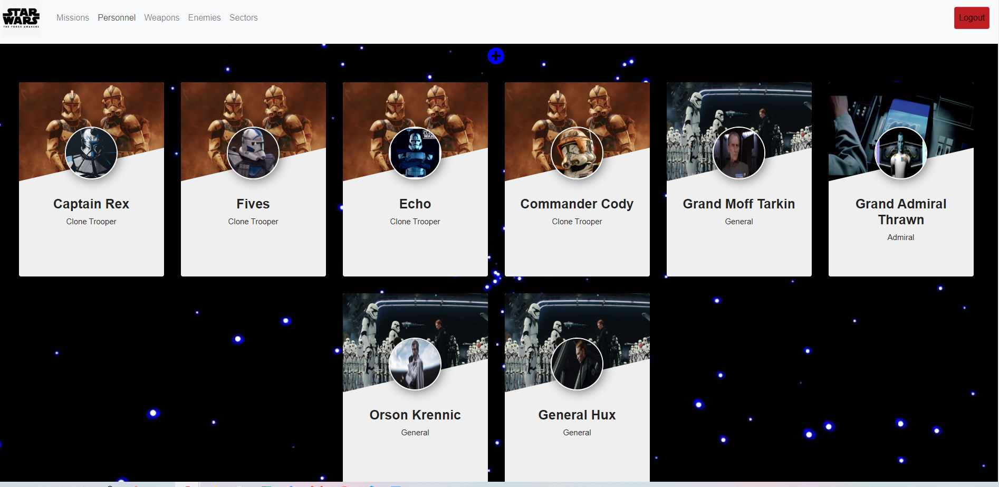
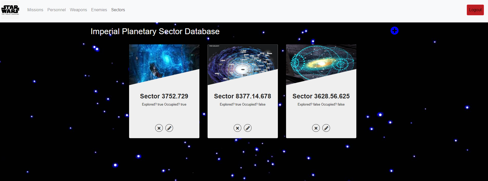
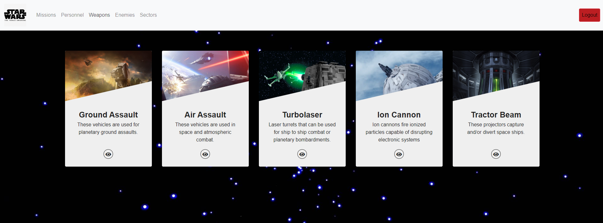
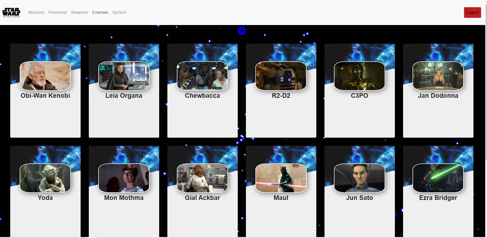

# Star Destroyer

## Description
This project showcases the use of firebase and json data. We used firebase to store our data. We used axios promises to retrieve the data capturing the response.

### Feature List
- Google Login Button with Firebase
- Firebase json data
- Home Page
- Missions
- Weapons
- Personnel
- Sectors
- Enemies
## Screenshots
### Home Page

### Missions View

### Personnel View

### Sectors View

### Weapons View

### Enemies View

## How to Run
1. Clone down this repo
1. Make sure you have http-server installed via npm. If not get it [HERE](https://www.npmjs.com/package/http-server).
1. Use the apiKeys.example.json to enter your API key information from firebase
1. On your command line run `hs -p 9999`
1. In your browser go to `http://localhost:9999`

## Contributors
[Monique Bass](https://github.com/Nikababy01)
Stephen Castaneda
Kenneth McEastland
Todd Spainhour